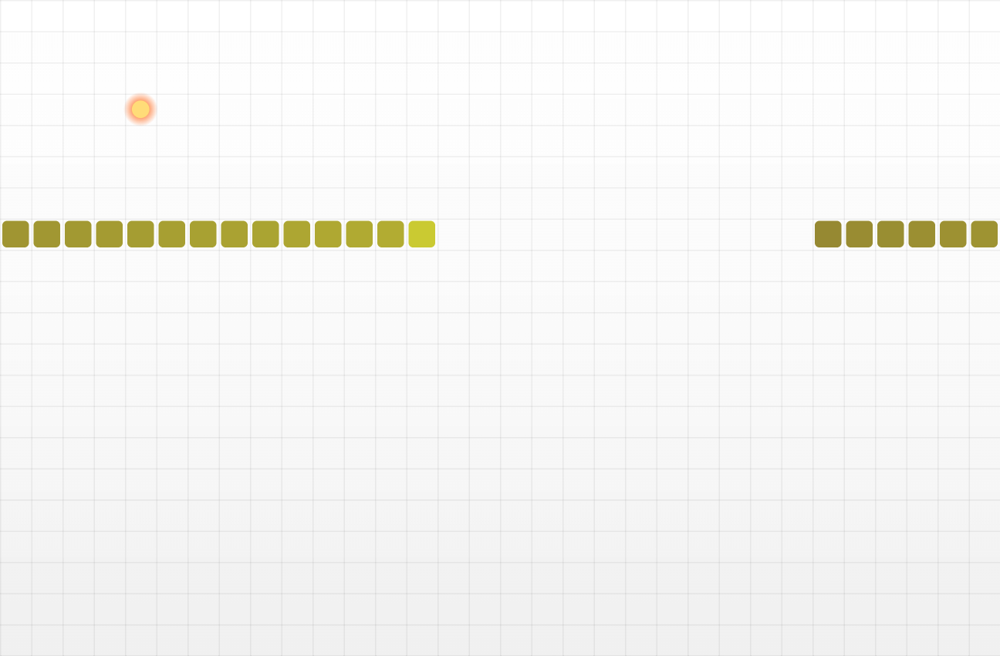

<div align="center">

# 🕷️ Venom Rush Retro Snake Game

### Premium Fast-Paced Survival Arcade Web Game

[](https://venomrushgame.netlify.app/)

[](https://adityamakhija-dev.github.io/venom-rush-retro-snake-game/)

[](https://github.com/adityamakhija-dev/venom-rush-retro-snake-game)

[](https://www.linkedin.com/in/adityamakhija-dev)

<br>

[]()

[]()

[]()

[]()

<br>

**Venom Rush is a modern, feature-rich retro snake survival web game built using HTML5, CSS3, and JavaScript.**

**It delivers smooth animations, fast performance, responsive gameplay, and a premium arcade-style user experience.**

<br>

## 🎮 Gameplay Preview


<br>

## 📸 Game Screenshot



</div>

---

# 🚀 Project Links

### 🌐 Netlify (Primary)

https://venomrushgame.netlify.app/

### ⚡ GitHub Pages

https://adityamakhija-dev.github.io/venom-rush-retro-snake-game/

### 💻 GitHub Repository

https://github.com/adityamakhija-dev/venom-rush-retro-snake-game

---

# ✨ Features

🎮 Classic Retro Snake Gameplay  
⚡ Smooth Animations  
🎯 Real-Time Score Tracking  
📱 Fully Responsive Design  
🚀 Fast Performance  
🎨 Premium UI Design  

---

# 🛠️ Tech Stack

Frontend:

HTML5  
CSS3  
JavaScript  

Deployment:

Netlify  
GitHub Pages  

Version Control:

GitHub  

---

# 🎯 Project Purpose

This project demonstrates:

• Frontend Development Skills  
• Game Logic Implementation  
• DOM Manipulation  
• Responsive Design  
• Live Deployment  

---

# 📂 Run Locally

Clone:• Game Logic Implementation  
• DOM Manipulation  
• Responsive Design  
• Live Deployment  

---

# 📂 Run Locally

Clone:

```
git clone https://github.com/adityamakhija-dev/venom-rush-retro-snake-game.git
```

Open:

```
index.html
```

---

# 👨‍💻 Developer

Aditya

Frontend Developer

LinkedIn  
https://www.linkedin.com/in/adityamakhija-dev

GitHub  
https://github.com/adityamakhija-dev

---

# ⭐ Support

If you like this project, please give it a ⭐ on GitHub.

---

# 📌 Recruiter Note

This is a professional portfolio project showcasing real-world frontend and JavaScript development skills.

I am open to Frontend Developer opportunities.
