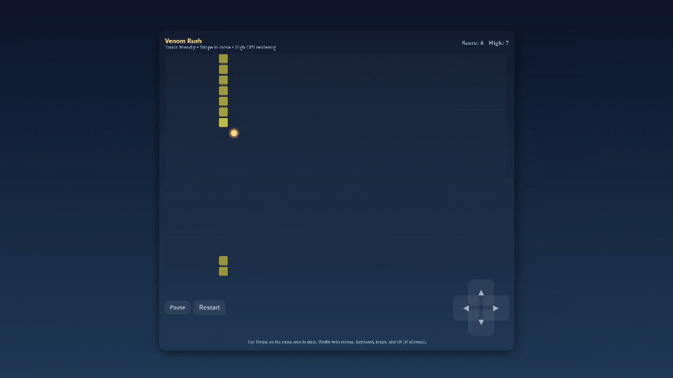
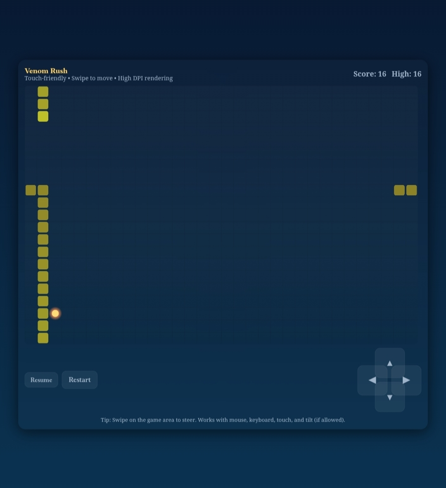

🕷️ Venom Rush – Retro Snake Game

Premium Fast-Paced Survival Arcade Web Game

🚀 A portfolio project showcasing JavaScript game development, DOM manipulation, and responsive frontend engineering.

   

"HTML5" (https://img.shields.io/badge/HTML5-Markup-orange?style=for-the-badge&logo=html5&logoColor=white)
"CSS3" (https://img.shields.io/badge/CSS3-Styling-blue?style=for-the-badge&logo=css3&logoColor=white)
"JavaScript" (https://img.shields.io/badge/JavaScript-Game_Logic-yellow?style=for-the-badge&logo=javascript&logoColor=black)
"Responsive" (https://img.shields.io/badge/Responsive-Design-success?style=for-the-badge&logo=googlechrome)

 Venom Rush is a modern retro-style Snake survival arcade game built using HTML5, CSS3, and pure JavaScript.

It delivers smooth gameplay, responsive controls, real-time score tracking, and an engaging arcade experience directly in the browser.

---

🎮 Gameplay Preview

---

🖼 Game Interface

---

🚀 Play the Game

Play Venom Rush instantly in your browser.

🎮 Live Game (Netlify)
https://venomrushgame.netlify.app/

⚡ Alternative Live Version (GitHub Pages)
https://adityamakhija-dev.github.io/venom-rush-retro-snake-game/

💻 GitHub Repository
https://github.com/adityamakhija-dev/venom-rush-retro-snake-game

---

✨ Features

🎮 Classic Retro Snake Gameplay
⚡ Smooth Animations and Movement
🎯 Real-Time Score Tracking
📱 Fully Responsive Design
🚀 Fast Performance with Lightweight Code
🎨 Clean Arcade-Style UI

---

🛠 Tech Stack

Frontend

- HTML5
- CSS3
- JavaScript

Deployment

- Netlify
- GitHub Pages

Version Control

- Git
- GitHub

---

🎯 Project Purpose

This project was built to demonstrate practical frontend development skills through an interactive browser game.

Key areas showcased include:

• JavaScript Game Logic Implementation
• DOM Manipulation and Real-Time Updates
• Responsive UI Design
• Performance Optimization for Browser Games
• Live Web Deployment and Project Hosting

---

🧠 What I Learned

While building this project, I strengthened my understanding of:

• Game loop mechanics in JavaScript
• Keyboard input handling
• Dynamic DOM updates during gameplay
• Optimizing browser-based performance
• Designing responsive game interfaces

---

📌 Recruiter Note

This project is part of my Frontend Developer portfolio and demonstrates practical skills in:

• JavaScript Game Logic
• DOM Manipulation
• Responsive UI Design
• Browser-based Game Development

I enjoy building interactive web experiences, tools, and games using modern frontend technologies.

I am currently open to Frontend Developer opportunities and excited to contribute to real-world products and engineering teams.

🔗 Portfolio:
https://adityamakhija-dev.github.io

🔗 LinkedIn:
https://www.linkedin.com/in/adityamakhija-dev

---

📂 Run Locally

Clone the repository:

git clone https://github.com/adityamakhija-dev/venom-rush-retro-snake-game.git

Navigate into the project folder:

cd venom-rush-retro-snake-game

Open the project in your browser:

index.html

No additional setup or dependencies are required.

---

⭐ Support

If you like this project, consider giving it a star ⭐ on GitHub.

It helps support the project and motivates further development.

---

📄 License

This project is open-source and available under the MIT License.
